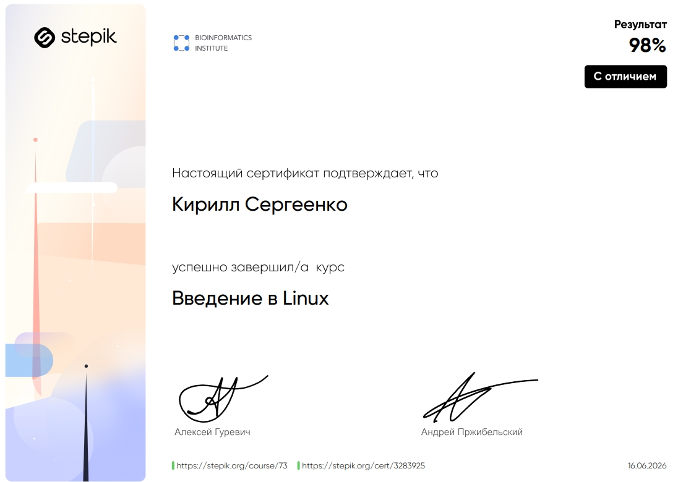
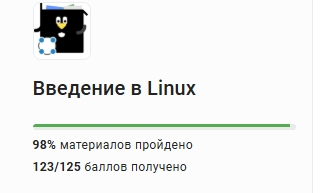

[← К оглавлению](../../README.md)

# Лабораторная работа №3

## Тема

Выполнение курса на Stepik и разработка bash-скриптов

## Паспорт работы

| Параметр | Значение |
| --- | --- |
| Дисциплина | DevOps |
| Формат отчёта | Markdown |
| Выполнил | Сергеенко К.С |
| Группа | 3315д |
| Преподаватель | Ушаков А. А. |
| Год | 2026 |

## Цель работы

Изучить основы написания скриптов на языке Bash в операционной системе Linux, закрепить навыки автоматизации командной строки и продемонстрировать результаты прохождения заданий курса Stepik «Введение в Linux».

## Ход выполнения

В рамках курса Stepik было освоено 98% материала и набрано `123/125` баллов. Ниже приведены ключевые задания и реализованные скрипты. Исходные файлы сохранены в каталоге [`scripts`](./scripts/).

*Рисунок 1. Результат прохождения курса «Введение в Linux».*

*Рисунок 2. Подтверждение прохождения курса.*

