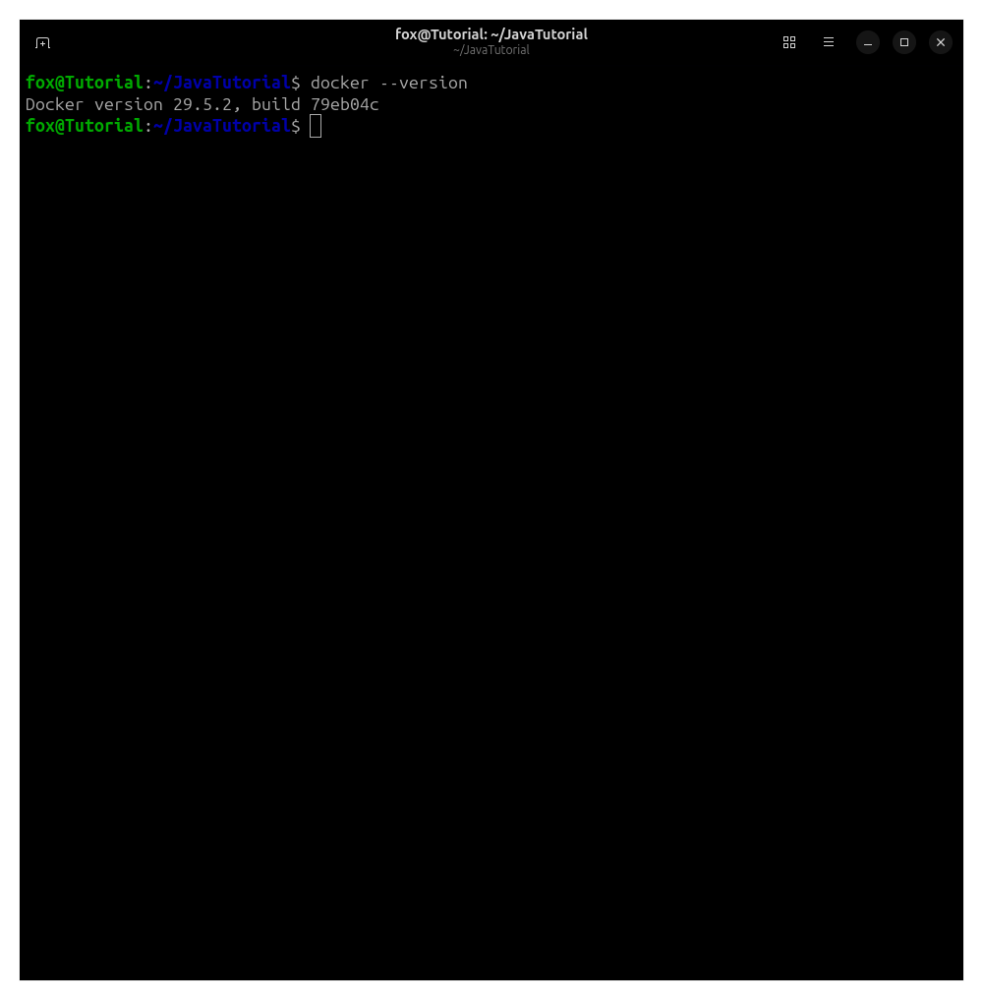
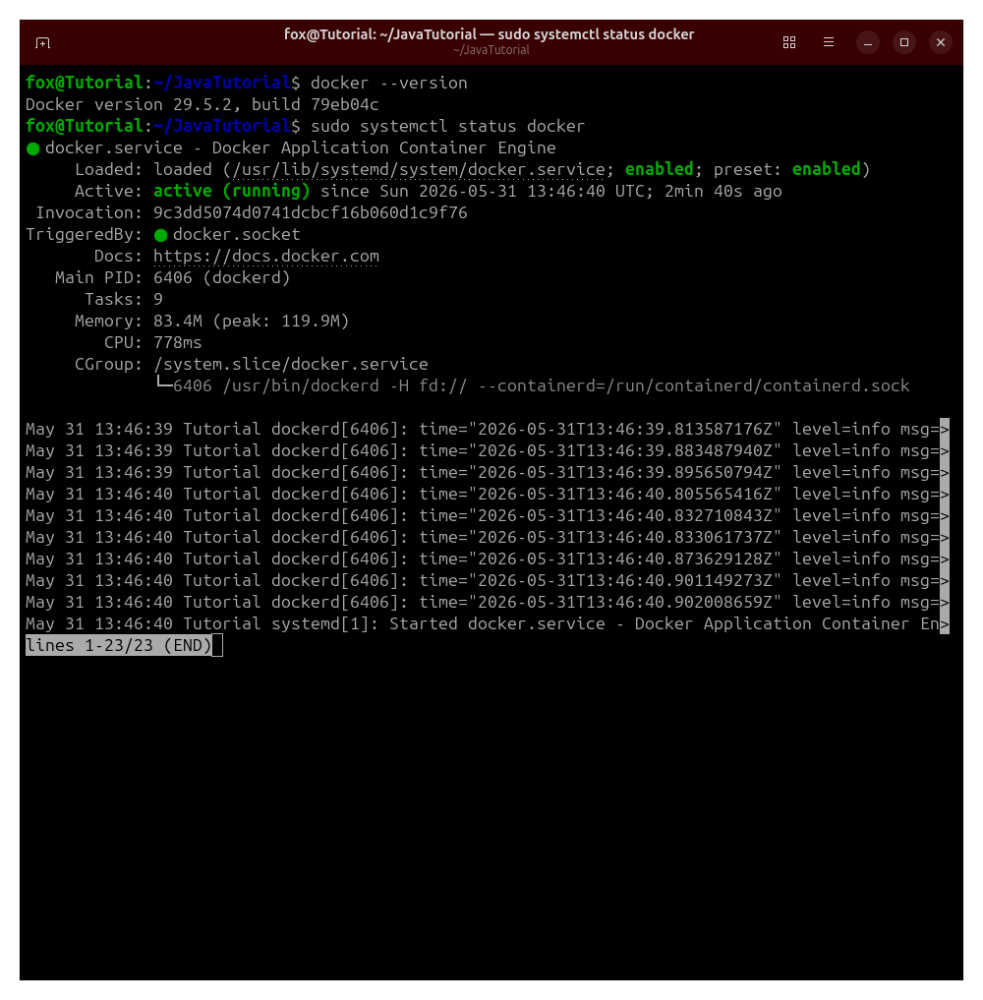
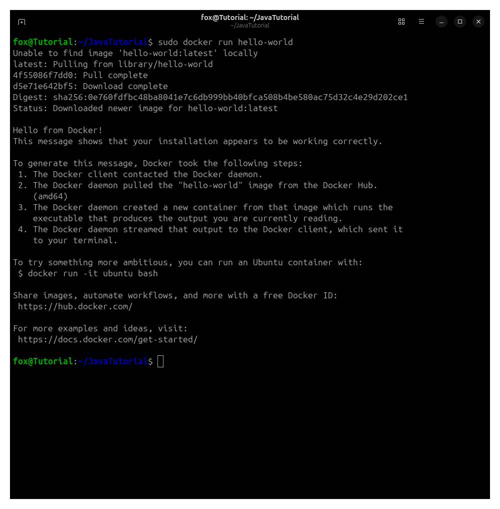
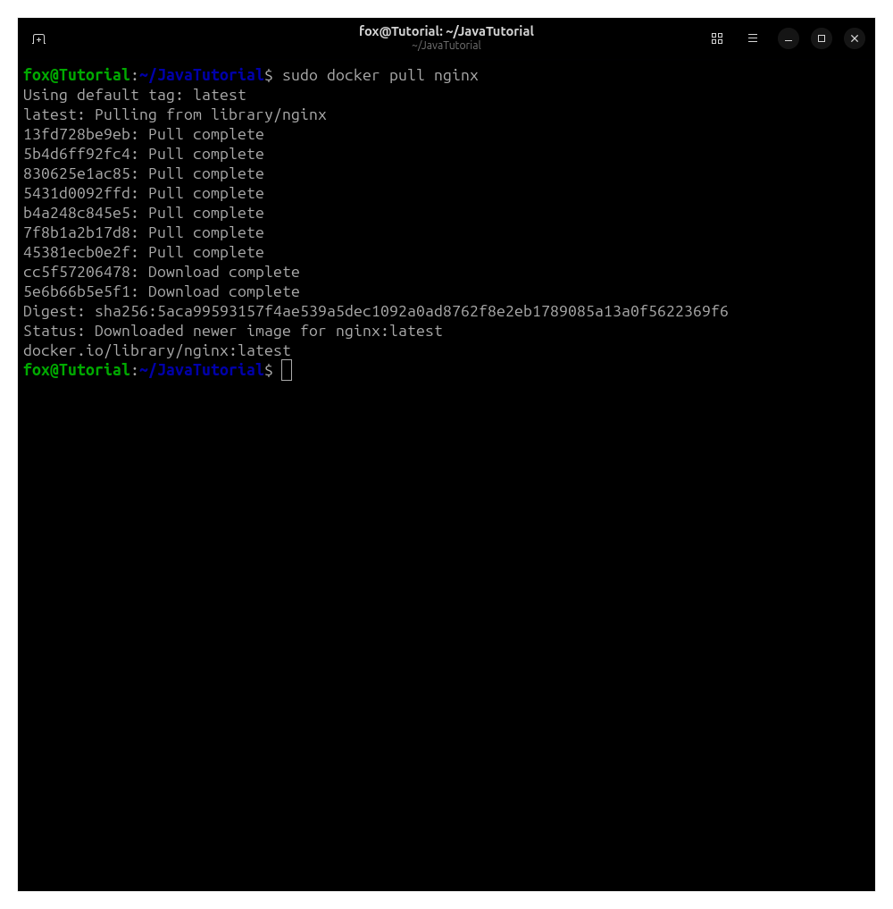
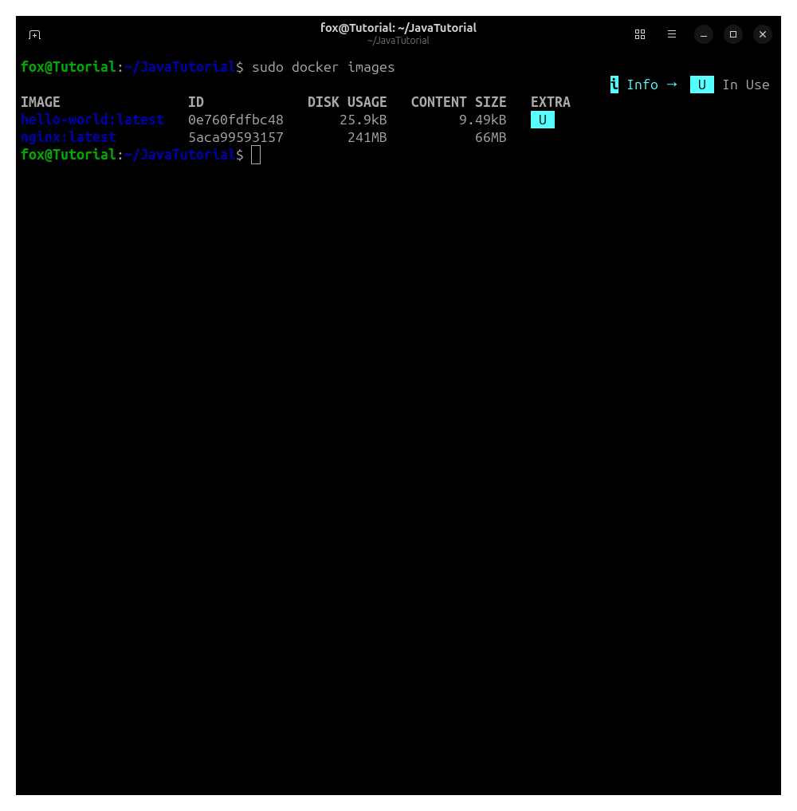
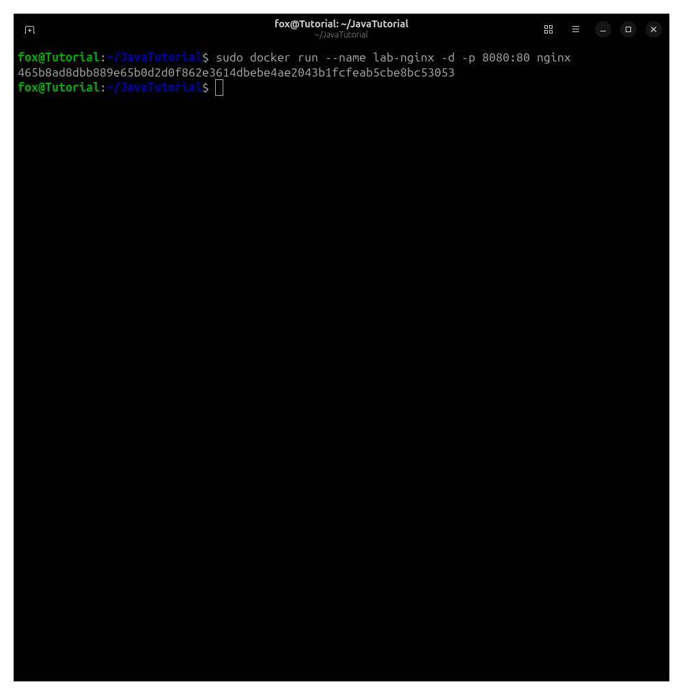
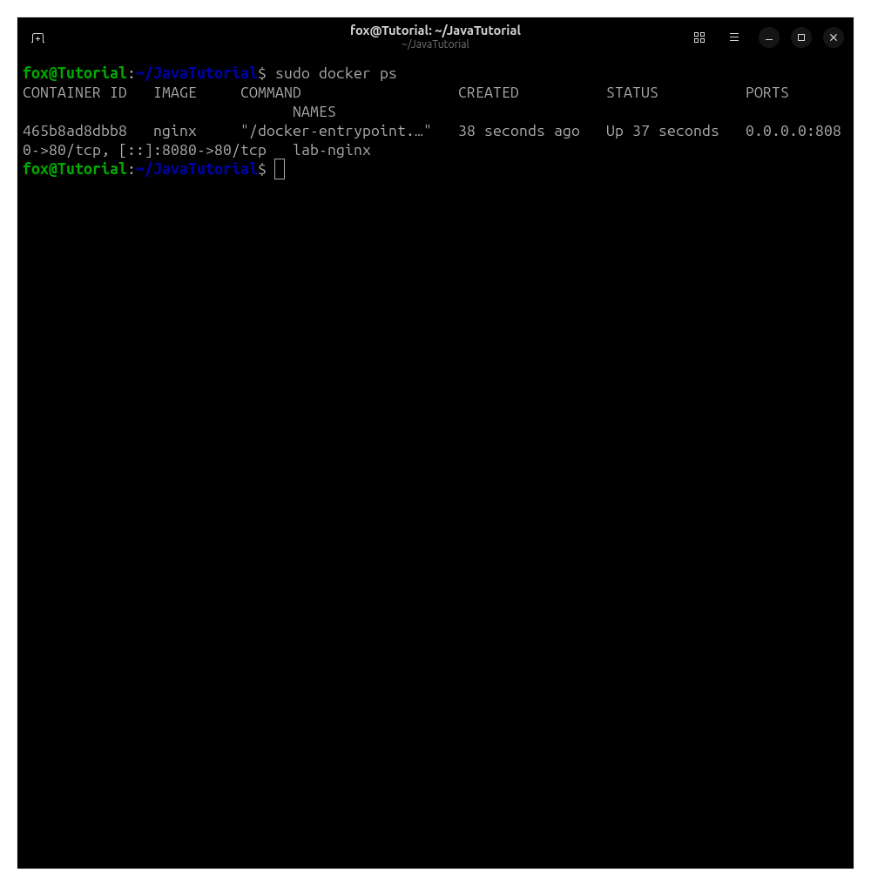
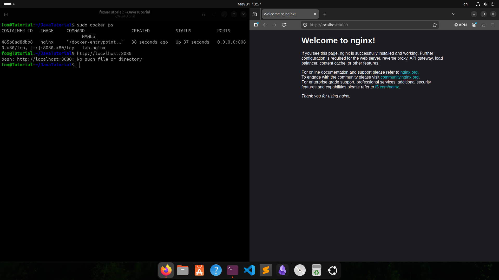

[← К оглавлению](../../README.md)

# Практическая работа №6

## Тема

Docker и основы контейнеризации

## Паспорт работы

| Параметр | Значение |
| --- | --- |
| Дисциплина | DevOps |
| Формат отчёта | Markdown |
| Выполнил | Вечерук И. В. |
| Группа | 3315д |
| Преподаватель | Ушаков А. А. |
| Год | 2026 |

## Цель работы

Изучить базовые возможности Docker, проверить работу Docker Engine в Linux, выполнить загрузку и запуск контейнеров, а также опубликовать веб-сервис из контейнера `nginx` на локальном порту.

## Теоретические сведения

Docker — это платформа контейнеризации, которая позволяет запускать приложения в изолированной среде. Контейнер содержит приложение и необходимые ему зависимости, но при этом использует ядро хостовой операционной системы. Благодаря этому контейнеры запускаются быстрее и потребляют меньше ресурсов, чем полноценные виртуальные машины.

Основными объектами Docker являются образы и контейнеры. Образ представляет собой готовый шаблон файловой системы и настроек приложения, а контейнер является запущенным экземпляром этого образа. Для получения образов чаще всего используется Docker Hub — публичный реестр, из которого Docker автоматически скачивает нужные слои образа.

Для управления контейнерами применяется команда `docker`. С её помощью можно проверять версию Docker, загружать образы, запускать контейнеры, просматривать список локальных образов и работающих контейнеров. При запуске веб-сервисов важным параметром является проброс портов, например `-p 8080:80`, где порт `8080` на хостовой машине связывается с портом `80` внутри контейнера.

## Ход выполнения

### 1. Проверка установленной версии Docker

На первом этапе была проверена установленная версия Docker. Команда `docker --version` выводит номер версии клиента Docker и подтверждает, что утилита доступна в терминале.

```bash
docker --version
```



*Рисунок 1. Выполнена проверка версии Docker. В терминале отображается `Docker version 29.5.2`, значит Docker установлен и команда `docker` корректно распознаётся системой.*

### 2. Проверка состояния службы Docker

Далее была проверена работа системной службы Docker через `systemctl`. Служба `docker.service` отвечает за Docker daemon — фоновый процесс, который создаёт контейнеры, управляет образами и взаимодействует с контейнерной средой.

```bash
sudo systemctl status docker
```



*Рисунок 2. Проверено состояние службы Docker. Статус `active (running)` показывает, что Docker daemon запущен, а пометка `enabled` означает, что служба будет запускаться автоматически при старте системы.*

### 3. Запуск тестового контейнера `hello-world`

После проверки службы был запущен стандартный тестовый контейнер `hello-world`. Так как образ отсутствовал локально, Docker автоматически скачал его из Docker Hub, создал контейнер и вывел диагностическое сообщение.

```bash
sudo docker run hello-world
```



*Рисунок 3. Запущен контейнер `hello-world`. Docker сначала скачал образ из репозитория, затем выполнил контейнер и вывел сообщение `Hello from Docker!`, подтверждающее корректную работу установки.*

### 4. Загрузка образа `nginx`

Для дальнейшей проверки был загружен официальный образ веб-сервера `nginx`. Команда `docker pull nginx` скачивает последнюю версию образа с тегом `latest` и сохраняет её в локальном хранилище Docker.

```bash
sudo docker pull nginx
```



*Рисунок 4. Загружен образ `nginx:latest`. В выводе видно скачивание отдельных слоёв образа, после чего Docker сообщает, что новый образ успешно загружен.*

### 5. Просмотр локальных Docker-образов

После загрузки был просмотрен список локальных образов. Команда `docker images` позволяет убедиться, что нужные образы действительно сохранены на компьютере и могут использоваться для запуска контейнеров.

```bash
sudo docker images
```



*Рисунок 5. Отображён список локальных образов Docker. В таблице присутствуют `hello-world:latest` и `nginx:latest`, что подтверждает успешную загрузку и наличие образов в локальном репозитории.*

### 6. Запуск контейнера с веб-сервером `nginx`

Затем был запущен контейнер на основе образа `nginx`. Параметр `--name lab-nginx` задаёт имя контейнера, ключ `-d` запускает его в фоновом режиме, а параметр `-p 8080:80` публикует порт `80` контейнера на порту `8080` хостовой системы.

```bash
sudo docker run --name lab-nginx -d -p 8080:80 nginx
```



*Рисунок 6. Запущен контейнер `lab-nginx` в фоновом режиме. После выполнения команды Docker вывел идентификатор контейнера, что означает успешное создание и запуск экземпляра `nginx`.*

### 7. Проверка работающего контейнера

Для контроля был просмотрен список запущенных контейнеров. Команда `docker ps` показывает только активные контейнеры, их идентификаторы, используемые образы, статус и опубликованные порты.

```bash
sudo docker ps
```



*Рисунок 7. Проверено, что контейнер `lab-nginx` находится в состоянии `Up`. В колонке `PORTS` видно соответствие `0.0.0.0:8080->80/tcp`, то есть порт `8080` хостовой машины перенаправлен на порт `80` внутри контейнера.*

### 8. Проверка доступа к `nginx` через браузер

На заключительном этапе был открыт адрес `http://localhost:8080` в браузере. Это позволяет проверить, что опубликованный порт доступен с хостовой системы и запросы действительно попадают в контейнер с `nginx`.

```text
http://localhost:8080
```



*Рисунок 8. В браузере открыта стандартная страница `Welcome to nginx!`, что подтверждает успешную работу контейнера и корректный проброс порта `8080` на порт `80`. В терминале также видно, что попытка ввести URL как команду Bash завершилась ошибкой, поэтому адрес был открыт именно через браузер.*

## Результаты

- Проверена установленная версия Docker.
- Подтверждено, что служба `docker.service` запущена и активна.
- Выполнен запуск тестового контейнера `hello-world`.
- Загружен официальный образ `nginx` из Docker Hub.
- Проверено наличие локальных образов Docker.
- Запущен контейнер `lab-nginx` в фоновом режиме.
- Выполнен проброс порта `8080` хостовой системы на порт `80` контейнера.
- Через браузер подтверждена доступность веб-сервера `nginx`.

## Вывод

В ходе практической работы были изучены базовые команды Docker и выполнен полный цикл работы с контейнером: проверка установки, контроль состояния службы, загрузка образов, запуск контейнера и проверка опубликованного веб-сервиса. Полученный результат показывает, что Docker Engine работает корректно, контейнер `nginx` успешно запущен, а проброс портов позволяет обращаться к сервису внутри контейнера через браузер на хостовой системе.
